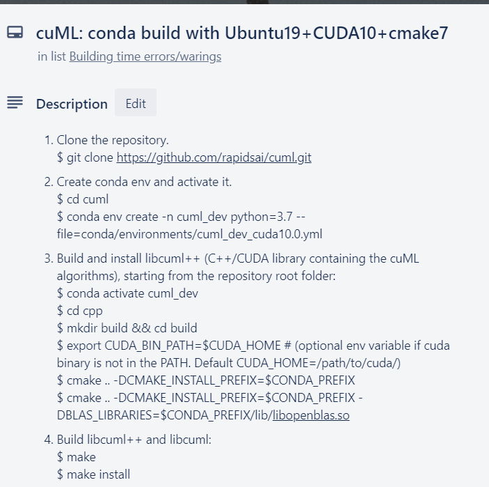

# ECE759
Git repo for 759 final project

1. CUDA implementation: see granger_cuda

* generate data of n_len

`g++ generate_data.cpp -o generate_data`

`./generate_data n_len`

*  granger causality test

`nvcc test_v2.cpp ols.cpp gen_lag_matrix.cu -lcublas -lcusolver -o test_v2 `

` ./test_v2 n_len`

2. cuML implementation: see cuml_ver2

